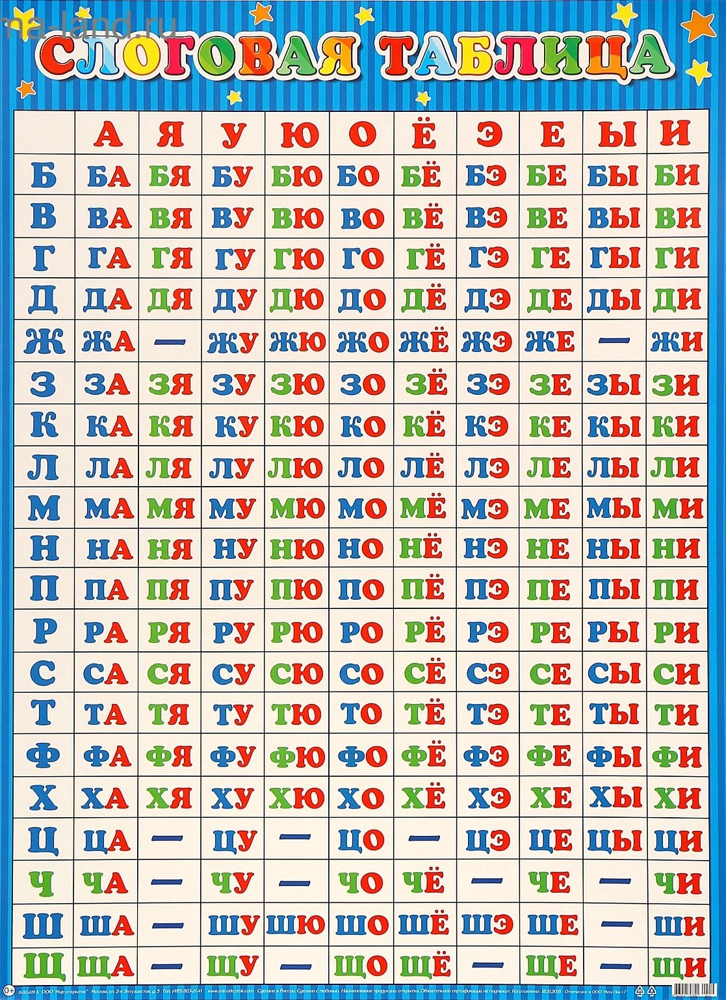

# Слоговые таблицы или как получить схему слова с помощью python 🙂

## Что такое слог?
Прежде всего, слог — это минимальная произносительная единица слова. Каждый слог обязательно включает один гласный звук. Количество слогов в слове равно количеству гласных звуков. Слог может состоять только из гласного (а-и-ст) или из сочетания гласного с одним или несколькими согласными (сто-л).

## Слоговые таблицы
Слоговая таблица — это учебное пособие, обычно в виде сетки, которое используется для отработки навыка чтения. Она помогает автоматизировать слияние согласной и гласной буквы в слог.

### Как они устроены? 
Таблица строится по принципу:

- по горизонтали располагаются гласные буквы;
- по вертикали располагаются согласные буквы;
- на пересечении строки и столбца образуется слог.

Пример слоговой таблицы:



## Для чего нужны слоговые таблицы?

- Отработка техники чтения: Ребенок учится не читать буквы по отдельности (М, А), а сразу видеть и произносить слог (МА).
- Развитие фонематического слуха: Помогает усвоить, как меняется звучание согласного в зависимости от следующей за ним гласной.
- Автоматизация навыка: Многократное повторение слогов по горизонтали и вертикали доводит их чтение до автоматизма.
- Обучение мягким и твердым слогам:  В таблице выше мягкая согласная получается в сочитании (с гласными Я, Ё, Ю, И, Е) и обозначается зеленым цветом, твердая согласная - синим. "Ч" и "Щ" всегда мягкие, а "Ж", "Ц", "Ш" - всегда твердые.

## Схемы слова
Схема слова — это графическое изображение структуры слова, которое показывает последовательность звуков (или слогов) и их характеристики. Звуковая (фонетическая) схема слова
Отражает звуковой состав слова. Каждый звук обозначается отдельным квадратом, который раскрашивается в определенный цвет.
Условные обозначения (цветовая схема):
- 🟥 Красный квадрат: Гласный звук (а, о, у, и, ы, э)
- 🟦 Синий квадрат: Твердый согласный звук (п, д, к, ш и т.д.)
- 🟩 Зеленый квадрат: Мягкий согласный звук (п', д', к', щ' и т.д.)

## Для чего нужны схемы слова?

- Развитие звукового анализа: Ребенок учится "слышать" слово, различать в нем отдельные звуки и давать им характеристику.
- Подготовка к письму: Понимание звукового состава — основа грамотного письма, особенно для правильного подбора проверочных слов.
- Обучение слогоделению: Помогает правильно делить слова для переноса.
- Наглядность: Цветные схемы делают абстрактные понятия (звуки) зримыми и понятными для ребенка.

## Краткий итог:

**Слоговые таблицы** — это инструмент для чтения, тренировки слияния букв в слоги.

**Схемы слова** — это инструмент для анализа структуры уже произнесенного или написанного слова (его звукового состава и деления на слоги).

Оба этих инструмента являются `фундаментальными` в начальном обучении русскому языку и помогают сформировать важнейшие языковые навыки.

## Причем тут python?

Идея этого проекта у меня возникла когда я помогал делать домашнее задание своему ребенку в первом классе. Этот проект можно использовать для:
- проверки схемы слова;
- в образовательных целях (если вы преподаете детям информатику в школе). Мне показалось что с таким проектом школьникам будет интересно работать (но это не точно ☺️).

## Испоьзование

```bash
git clone --recursive https://github.com/BoNA1992/word-scheme.git
cd word-scheme
pip install -r requirements.txt
python word_to_scheme.py
```


